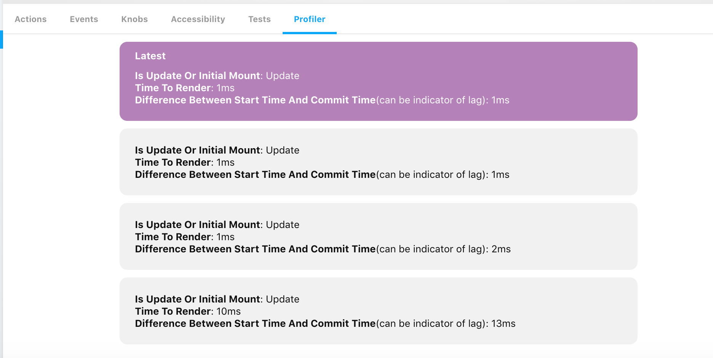

# Story React Profiler Addon

This can be used to wrap stories in the experimental React Profiler and receive performance information in a panel

## Getting Started

Install this addon by adding the `storybook-addon-react-profiler` dependency:

```sh
yarn add storybook-addon-react-profiler
```

or

```sh
npm install storybook-addon-react-profiler
```

First configure it as an addon by adding it to your addons.js file (located in the Storybook config directory).

```js
import 'storybook-addon-react-profiler/register';
```

Then you can import `withProfiler` in your stories and use like this:

```js
import { storiesOf } from '@storybook/react'
import { withProfiler } from 'storybook-addon-react-profiler'

storiesOf('Button', module)
  .addDecorator(withProfiler)
  .add('First', () => (
    <button onClick={() => console.log('hello'))>Hello</button>
  ))
```

Interacting With the component will produce an outcome like the below image in the Profiler panel. 

